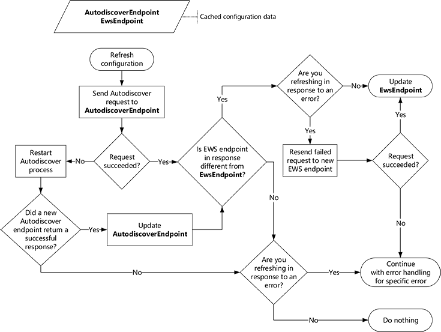

# Refresh configuration information by using Autodiscover

Learn how and when to refresh configuration information for your Exchange connection by using Autodiscover.
  
When your EWS application runs for the first time, Autodiscover provides a great way for you to collect the information you need in order to connect to your user's Exchange mailbox. But Autodiscover isn't just for first time use. Using Autodiscover on a regular basis can help keep your application connected by enabling it to respond to changes in the Exchange deployment.
  
## Cache Autodiscover endpoint and EWS settings

While we recommend that you use Autodiscover regularly, how regularly you use it requires some consideration. Ideally you can balance responding quickly to changes in the environment against generating too much unnecessary network traffic. When your application gets a successful Autodiscover response for the first time, you should save the following information so that you do not have to repeat the Autodiscover process every time you send an EWS request.
  
**Table 1. Information to cache for Autodiscover requests**

|**Setting to cache**|**Valid for…**|**Details**|
|:-----|:-----|:-----|
|Autodiscover endpoint    |As long as it works    |When you save the Autodiscover endpoint that returned a successful response, you do not have to repeat the process of [generating a list of Autodiscover endpoints](how-to-generate-a-list-of-autodiscover-endpoints.md) and trying them until you get a successful response.   **NOTE**: The EWS Managed API does not support caching the Autodiscover endpoint.           |
|EWS URL and any other settings retrieved from the Autodiscover response    |One week    |By saving the EWS URL and other related settings, you do not have to [send a new Autodiscover request](how-to-get-user-settings-from-exchange-by-using-autodiscover.md) for each EWS request or if your application restarts. However, even if an EWS URL works for your user, a server might be available that is more optimal.   For example, the user's mailbox might have moved to a new mailbox server, resulting in a new preferred EWS endpoint. We recommend that you refresh your user settings by sending a new Autodiscover request after one week has passed since your last Autodiscover request. This time can be adjusted to meet the requirements of your application.    |
   
## Refresh cached configuration information

Now that you have the information cached, let's examine how you can keep that cache fresh. We recommend that you refresh your cached information when:
  
- The information's validity period expires.
    
- A [Connection-related error](#bk_ConnectionErrors) occurs AND your cached information was last refreshed over an hour ago.
    
To refresh your cached information, send an Autodiscover request to a cached Autodiscover endpoint, and do the following:
  
- If the request succeeds, compare the EWS endpoint in the response with the cached EWS endpoint, and do the following:
    
  - If they are different, use the new EWS endpoint. If you're refreshing to recover from an error, retry the failed request with the new endpoint.
    
  - If they are the same, continue to use the original EWS endpoint. If you're refreshing to recover from an error, handle the error as appropriate.
    
- If the request fails, start the [Autodiscover process](autodiscover-for-exchange.md) from the beginning. After you get a successful response, replace the cached Autodiscover endpoint with the Autodiscover endpoint that succeeded and continue to use the new EWS endpoint. If you do not get a successful response, continue to use the original Autodiscover endpoint and EWS endpoint. If you're refreshing to recover from an error, handle the error as appropriate. 
    
The following figure provides a visual representation of this process.
  
**Figure 1. Process for refreshing configuration information by using Autodiscover**

  
### Connection-related errors

Refreshing your cached configuration information can help with some errors, but not all. 
  
**Table 2. Errors addressed by refreshing your cache**

|**Error**|**EWS Managed API implementation**|**Notes**|
|:-----|:-----|:-----|
|DNS or network failure errors   Example: Host name could not be found.    |[ServiceRemoteException](https://docs.microsoft.com/dotnet/api/microsoft.exchange.webservices.data.serviceremoteexception?view=exchange-ews-api)   |Any error that indicates that the server could not be found or could not be reached might be resolved by trying Autodiscover.    Your cached EWS endpoint might no longer be valid, and Autodiscover might be able to point you to the new server.    |
|HTTP status errors   Example: 503 Service Unavailable    |[ServiceRemoteException](https://docs.microsoft.com/dotnet/api/microsoft.exchange.webservices.data.serviceremoteexception?view=exchange-ews-api)   |HTTP status errors can happen for many different reasons.   However, it's a good idea to try Autodiscover to see if a new EWS endpoint is available for the user.    |
|EWS error codes    Example: ErrorConnectionFailed   |[ResponseCodeType](../web-service-reference/responsecode.md)   | Most EWS error codes don't warrant refreshing your configuration information.   However, the following specifically indicate that the configuration information needs to be updated: - **ErrorConnectionFailed**  - **ErrorMailboxMoveInProgress**   |
   
## See also

- [Autodiscover for Exchange](autodiscover-for-exchange.md)  
- [Generate a list of Autodiscover endpoints](how-to-generate-a-list-of-autodiscover-endpoints.md)   
- [Get user settings from Exchange by using Autodiscover](how-to-get-user-settings-from-exchange-by-using-autodiscover.md)
    

